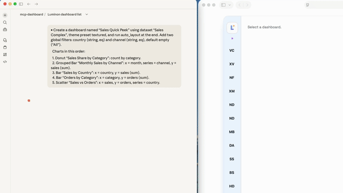

<div align="center">

#  Luminon MCP Dashboard

**Turn prompts into dashboards.**  
Upload CSV/JSON and say: “Bar chart of sales by region.” Done.  
Visit: [luminon.dev](https://luminon.dev)
Demo: [demo.luminon.dev](https://demo.luminon.dev) (renderer)

[](https://www.npmjs.com/package/luminondevmcp-dashboard)
[](https://github.com/luminondev/luminon-mcp-dashboard/stargazers)
[](LICENSE)

</div>

Luminon is an AI-first dashboard builder with three pieces in one repo:

- **MCP server**: dashboard, chart, dataset, filter tools, plus natural-language actions.
- **React renderer**: local preview and static demo build.
- **`luminon` CLI**: start the MCP over stdio (AI tools) or serve the packaged renderer.

## ✨ Why you’ll like it (devs and non-devs)
- **Zero-code**: natural language → auto layout + charts (bar, line, donut, scatter, KPI).
- **Themes & filters**: colors, layouts, global filters; presentation mode.
- **Live data**: swap datasets, use snapshots for recovery.
- **MCP + Web**: Node.js/TS for your AI assistant, React/Nivo to view/share.
- **Optional REST/SSE**: update datasets without extra SDKs or tokens.

<div align="center">

</div>

## 🚀 Quick start
```bash
npx -y @luminondev/mcp-dashboard start                 # Start local renderer
npx -y @luminondev/mcp-dashboard mcp --mode full        # MCP config for AI tools (Claude, Gemini, Codex, Perplexity)
```

Modes:
- `full` exposes every MCP tool
- `lite` lowers token use while keeping `dashboard_nl` (natural language)
- `ultra-lite` is the smallest surface for tight quotas

## Local development

Install and build:
```bash
npm install
npm run build
```

Run dev servers (hot reload):
```bash
npm run dev:mcp
npm run dev:renderer
```

Run built CLI directly:
```bash
node packages/cli/dist/index.js mcp --mode lite
node packages/cli/dist/index.js start renderer
```

Local URLs:

- renderer UI: `http://localhost:5173`
- renderer API during Vite dev: `http://localhost:4010`

## Built-in demos and seeds

The repo ships seeded datasets and dashboards under `data/`. These are copied into the user data directory on first run and synced incrementally on startup when new seed ids are added.

The renderer build also regenerates the static demo from the same seed files, so demo dashboards stay aligned with the repo state.

## Project layout

- `packages/mcp-server` — MCP tool server
- `packages/renderer` — renderer web app and packaged API/static server
- `packages/cli` — `luminon` CLI
- `packages/shared` — shared schemas and types
- `docs/MCP_DOCUMENTATION.md` — full MCP reference

<div align="left" style="margin-top: 24px;">
  <a href="docs/MCP_DOCUMENTATION.md" style="color:#7fb1b8; font-family: Georgia, 'Times New Roman', serif; font-size:20px; text-decoration:none;">
    MCP Docs →
  </a>
  <span style="color:#7fb1b8; font-family: Georgia, 'Times New Roman', serif; font-size:20px;"> | </span>
  <a href="CONTRIBUTING.md" style="color:#7fb1b8; font-family: Georgia, 'Times New Roman', serif; font-size:20px; text-decoration:none;">
    Contribute
  </a>
  <span style="color:#7fb1b8; font-family: Georgia, 'Times New Roman', serif; font-size:20px;"> | </span>
  <a href="LICENSE" style="color:#7fb1b8; font-family: Georgia, 'Times New Roman', serif; font-size:20px; text-decoration:none;">
    MIT License
  </a>
  <span style="color:#7fb1b8; font-family: Georgia, 'Times New Roman', serif; font-size:20px;"> | </span>
  <a href="https://luminon.dev" style="color:#7fb1b8; font-family: Georgia, 'Times New Roman', serif; font-size:20px; text-decoration:none;">
    luminon.dev
  </a>
</div>

> Status: **Beta** — expect breaking changes until 1.0.
